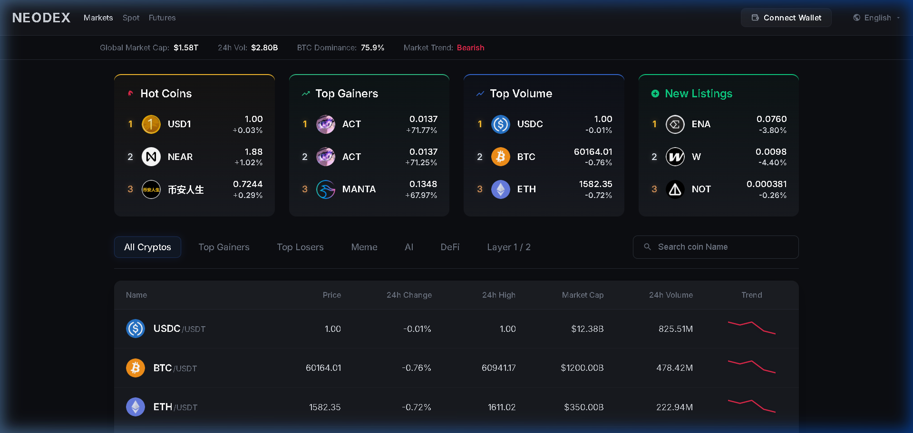
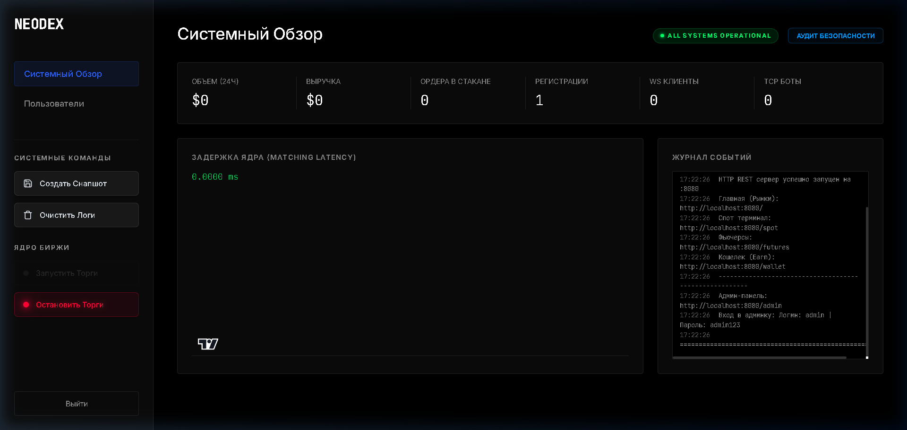

# NEODEX: Full Project Overview 

**NEODEX** is a comprehensive cryptocurrency exchange simulation (DEX / CEX interface) featuring a professional trading terminal, live market data, and an advanced architecture. The project is built with a **Golang** backend and uses pure **HTML/CSS/JS** for the frontend, entirely avoiding heavy frameworks.

This document provides a complete description of all implemented features.

---

## 1. User Interface (Frontend)

We have designed a modern, highly responsive UI inspired by top crypto exchanges (such as Binance and Bybit), featuring a dark theme, beautiful gradients, and instantaneous feedback.

### Main Page (Markets)
- **Global Statistics**: A scrolling marquee at the top displaying total market capitalization, 24-hour trading volume, and BTC dominance, all calculated dynamically in real time.
- **Interactive Highlight Cards**:
  - *Top Gainers*, *Hot Coins*, *Top Volume*.
  - *New Listings*: A dynamic widget connected to the backend that showcases the newest coins recently added to the market.
- **Markets Table**:
  - Loads 350+ real trading pairs directly from Binance.
  - Custom category filters: `Meme`, `AI`, `DeFi`, `Layer 1/2`.
  - Built-in search functionality for quick coin lookup.
  - Sparklines (miniature charts) for each coin, visually representing price changes.
  - Simulated Market Cap column.

### Trading Terminal (Spot)
- **TradingView Integration**: A professional, interactive price chart (Candlesticks). We have removed unnecessary UI elements (like the Bitstamp logo) to make the chart feel completely native.
- **Live Orderbook**: Real-time display of Buy and Sell orders (Bids/Asks) updated continuously via WebSockets.
- **Live Market Trades**: Instantaneous feed of market buys and sells.
- **Smart Pair Selection**:
  - A side panel and modal for finding pairs by base or quote currency (USDT, USDC, BTC, etc.).
  - A **" NEW"** badge automatically appears next to recent listings!
- **Order Form**:
  - Supported order types: `Limit`, `Market`, `Stop Limit`.
  - Interactive % slider to quickly allocate a portion of the available deposit.
  - Dynamic `Total USDT` recalculation upon price or quantity changes.
- **History Panel**: Includes *Open Orders* and *Order History* tabs, fully connected to the backend REST API.
- **Market Orders Focus**: For maximum UI simplicity, limit order creation has been visually streamlined to prioritize instant market execution in the current iteration.

### Derivatives (Futures)
- **Dedicated Trading Interface**: An advanced panel tailored for trading futures contracts, supporting only pairs with USDT and USDC as quote currencies.
- **Margin Trading**:
  - Adjustable Leverage from 1x to 100x with dynamic calculation of the required margin.
  - Support for both Isolated and Cross margin modes.
- **Positions Management**:
  - The **Positions** tab provides real-time updates on position size, entry price, unrealized PnL, and estimated liquidation price.
  - Position risks are isolated and handled efficiently by the core engine.

###  Wallet / Portfolio Dashboard
A completely redesigned wallet page (accessible via the **Wallet** link in the main menu or at `/wallet`) that aggregates all user assets into an elegant dashboard.
- **Estimated Balance**: Dynamic calculation of the total portfolio value in USD based on real-time Binance prices.
- **Interactive Pie Chart**: Visual distribution of assets with a detailed legend and percentage breakdown.
- **Assets Table**: A comprehensive list of held coins featuring columns for `Total`, `Available`, `In Order`, and `Value (USD)`. Original logos are automatically fetched for each asset.
- **Quick Actions**: One-click transition to the trading terminal for any specific coin.

### Admin Panel (System Control)

A dedicated, highly secure dashboard (`/admin`) for platform administrators to monitor and control the exchange in real-time:
- **Live Core Metrics**: Visualizes active WS/TCP connections, 24h trading volume, total revenue, and real-time engine latency (without any mock data).
- **Matching Engine Control**: "Start Trading" and "Stop Trading" buttons directly interface with the Golang routing core. Stopping trading atomically rejects all new incoming orders across all active markets.
- **User Management**: A clean table displaying all registered users, their balances, and the ability to instantly lock/unlock specific accounts from trading.
- **System Commands**: Allows administrators to clear system logs or manually trigger an **AOF Snapshot**, saving the entire in-memory state of the exchange to a persistent `snapshots/` folder.

---

## 2. Backend (Golang)

The backend is built from scratch and acts as a high-performance proxy between our UI and the Binance core, while also containing custom business logic.

### REST API
- **Order and Balance Management**: Endpoints such as `/api/v1/order`, `/api/v1/balance`, and `/api/v1/orders` simulate order execution and retrieve the user's virtual balance.
- **Caching Proxy for Icons (`/api/v1/icon`)**:
  - Binance blocks direct image loading due to CORS policies. Our backend bypasses this by securely fetching the original colored icons from Binance's private API and serving them to the frontend.
  - Implements RAM-based caching for instantaneous image loading.

### Automated Listings Scanner (Background Scanner)
- The server includes a built-in background daemon that polls the markets every hour.
- A local database is maintained in the `data/` directory using JSON formats (`known_symbols.json` and `new_listings.json`).
- Whenever the scanner detects a new trading pair, it records it and exposes it via the `/api/v1/new-listings` endpoint. This allows the frontend to automatically attach the **NEW** badge without any manual intervention from developers.

### WebSockets Hub
- To prevent browser lag caused by continuous polling, the backend maintains a persistent connection to `wss://stream.binance.com:9443` (Binance WSS).
- Our internal `wsHub` reads the raw streams, parses the data, and broadcasts clean JSON payloads to all connected clients (browser tabs) efficiently.

---

## 3. Project Architecture
The project utilizes a standard Go modular structure, ensuring all components are cleanly separated:
- Directories: `cmd/`, `internal/api/`, `internal/ui/` (with subdirectories for scripts and styles).
- Instead of using bloated, separate HTML files, the entire frontend is generated and bundled within the Go code. This makes deployment instantaneous—everything is compiled into a single executable binary (`dex.exe`)!

> [!NOTE]
> This project serves as a robust foundation. From this base, it is easy to implement Web3 wallet connections (like MetaMask) or integrate real Binance API keys for live, real-world trading.

---

> [!CAUTION]
> **LEGAL NOTICE & PROPRIETARY LICENSE**
> 
> This project is closed-source and is a strictly proprietary product. 
> The use, running, copying, modification, merging, publishing, distribution, sublicensing, and/or sale of this software, in whole or in part, in any form or medium, is **STRICTLY PROHIBITED**. 
> For full details, see the [LICENSE](file:///d:/DEX/LICENSE) file.
